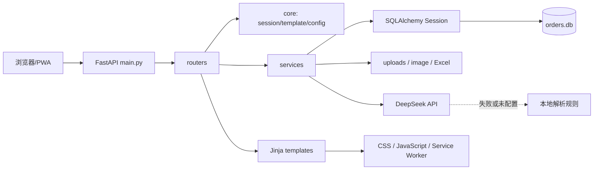
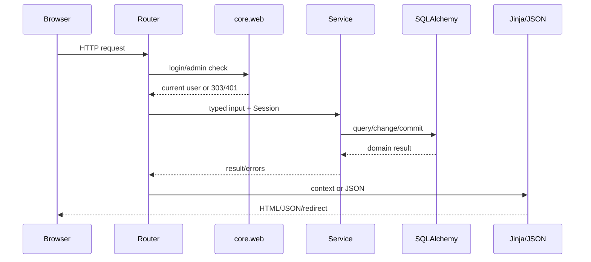
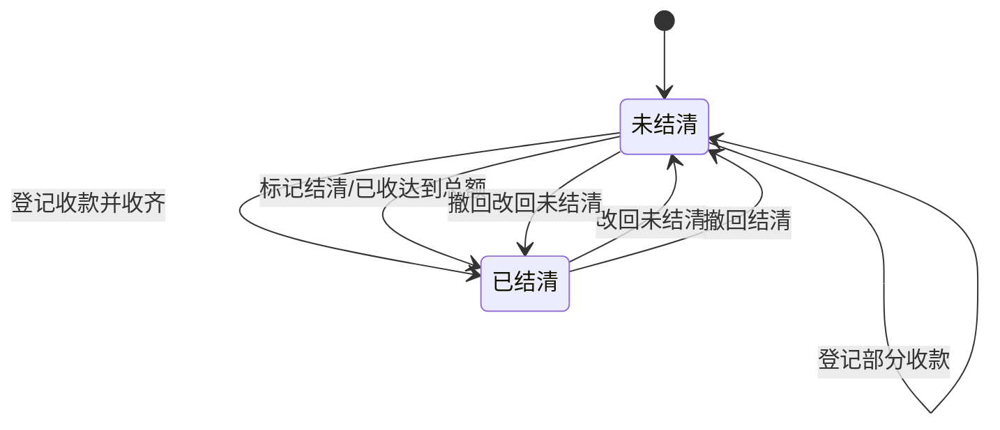
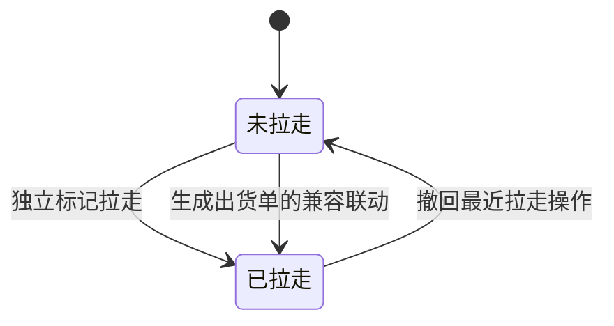

# 方圆订单系统项目架构指南

> 本文档是本项目开发、维护、评审和 AI 协作的架构事实源。修改业务边界、公开路由、数据模型、目录职责或运行方式时，必须在同一变更中更新本文档。

## 1. 项目定位

方圆订单系统是面向店铺、加工厂、生产和出货人员的中文订单管理后台。目标用户不需要技术背景，系统优先解决以下问题：

- 快速录入客户、商品、规格、数量、单价和已收金额，并在后续分批登记每次收款。
- 自动计算订单总额、欠款金额和结清状态。
- 集中查看未结清、已拉走未结清、未拉走和未打印订单。
- 从订单生成单页 A4 出货单，并记录打印与拉走状态；三层复写纸由打印机一次压印产生三张，不在页面内重复排三联。
- 对付款、打印和拉走操作保留日志，并允许撤回最近一次可逆操作。
- 归档商品图片资料，按分类和编号检索，并导出临时图片或 Excel 清单。
- 通过管理员账号维护普通用户和管理员。
- 使用语音或自然语言生成订单草稿和只读筛选条件；外部模型不可用时自动降级到本地规则。

### 1.1 核心用户

| 用户 | 核心任务 | 权限边界 |
|---|---|---|
| 店铺/接单人员 | 新建、查询、编辑订单，查看欠款 | 登录后可用 |
| 生产/出货人员 | 查看待处理订单、打印出货单、标记拉走 | 登录后可用 |
| 财务/管理人员 | 查看欠款、结清与撤回付款状态 | 登录后可用 |
| 管理员 | 打印设置、用户新增/编辑/删除 | 仅管理员 |
| 资料查看者 | 查看公开图片资料页 | `/showcase` 可直接访问，但禁止搜索引擎收录 |

### 1.2 明确不在当前系统内的能力

- 当前没有独立打印客户端、打印任务领取 API、失败重试队列或打印机在线状态。
- 当前“打印”是服务端为每个订单生成一张浏览器 A4 打印页面，并在生成时同步标记为已打印和已拉走。打印版固定使用 A4 纵向零页边距页框，内容保留小幅机内安全边距；三层复写纸只发送一次打印任务。
- `init_user.html` 是保留模板，当前没有 `/init-user` 路由；首次账号通过 `create_user.py` 创建。
- 当前没有订单生产状态、库存、物流、客户主数据或多租户体系。
- 当前不引入 React、Vue、Tailwind 或前后端分离框架。

### 1.3 当前项目进度快照（2026-06-21）

本节是后续开发和 AI 对话的首要进度入口。开始工作时除架构规则外，必须先核对本节与实际工作区；完成可上线里程碑后必须同步更新日期、版本锚点、验证结果和待办。

**已完成并上线：**

- 后端已完成分层整理，稳定依赖方向为 `main -> routers -> services -> models/db/core`，业务逻辑不再集中在 `main.py`。
- 订单流程已覆盖新建、编辑、搜索/筛选、分次收款、结清/改回、独立拉走、打印联动、撤回、删除和操作日志。
- 手机订单页已上线结果优先版：首屏显示搜索、业务状态和订单结果；卡片主操作为收款与拉走；手机端隐藏全部打印筛选、状态、按钮和打印设置入口。
- 桌面端打印流程继续保留单个/批量 A4 出货单、打印文案设置和打印后兼容标记拉走，不受手机端隐藏规则影响。
- 语音/自然语言录单与只读筛选已接入 DeepSeek 兼容接口，并保留无密钥或外部调用失败时的本地规则降级。
- 图片资料已覆盖分类、编号、压缩上传、公开浏览、管理删除以及 PNG/XLSX 报价导出；用户管理已覆盖管理员权限和当前管理员自保护。
- 后台模板已统一到共享布局，站点备案页脚、确认框、Flash、底部导航和移动端交互均集中复用。

**当前线上与版本锚点：**

- 生产服务为 `order-app.service`，运行用户 `xrrg`，由 Nginx 反向代理到 `127.0.0.1:8000`，启动入口保持 `app.main:app`。
- 当前 PWA 缓存名为 `order-app-v8`；主样式版本为 `app.css?v=20260621-4`；订单页脚本版本为 `orders.js?v=20260621-2`。
- 正式 UI 的事实源仅为 `app/templates/`、`app/static/css/` 和 `app/static/js/`。一次性 `preview/` 设计稿已在上线后删除，不得按旧预览文件恢复或复制逻辑。

**最近一次上线验收：**

- 完整 pytest 回归：`20 passed`；前端模板/静态资源契约：`7 passed`。
- Python 编译、全部 Jinja 模板编译、临时数据库迁移测试、生产用户导入 `app.main` 均通过。
- `order-app.service` 重启后状态为 `active (running)`；经 Nginx 验证 `/orders` 正常跳转登录，新版 CSS 与订单 JavaScript 均返回 HTTP 200。
- 上述数字是 2026-06-21 的已验证快照；测试数量或资源版本变化后必须在同一变更中更新本节。

**下一阶段优先事项：**

1. 为公网部署补齐 HTTPS 强制、安全 Cookie、CSRF 和登录限速。
2. 如需确认物理打印成功、离线状态或失败重试，单独设计真实打印客户端与任务队列，不改写当前浏览器打印语义。
3. 财务精度要求提高时，以专项迁移将浮点金额改为 Decimal 或整数分，并覆盖历史数据兼容。
4. 公开资料若包含敏感内容，改为鉴权存储，不能只依赖 `robots.txt`。

## 2. 技术栈

| 层级 | 技术 |
|---|---|
| Web | FastAPI、Starlette SessionMiddleware |
| 模板 | Jinja2，服务端渲染 |
| 数据 | SQLAlchemy 2、SQLite |
| 认证 | Session Cookie、Passlib/Bcrypt |
| 前端 | 原生 HTML、模块化 CSS、原生 JavaScript |
| 图片与导出 | Pillow、openpyxl |
| AI | DeepSeek 兼容 Chat Completions API、本地正则降级 |
| PWA | Web Manifest、Service Worker |
| 测试 | pytest、httpx ASGITransport、临时 SQLite |

默认启动入口保持为：

```bash
.venv/bin/uvicorn app.main:app --host 0.0.0.0 --port 8000
```

## 3. 总体架构



### 3.1 固定依赖方向

```text
app.main
  -> app.routers
      -> app.services
          -> app.models / app.db / app.core
      -> app.core.templating / app.core.web
templates -> static assets
```

必须遵守：

- `main.py` 只创建应用、挂载静态资源、配置中间件、执行生命周期和注册路由。
- Router 只负责 HTTP 参数、权限判断、模板/JSON/重定向响应和 Flash 提示。
- Service 负责校验、状态计算、查询、持久化、日志、导出和外部服务调用。
- Model 只描述持久化结构，不依赖 Router、Service 或模板。
- Template 不执行数据库查询，不承载金额或状态业务规则。
- JavaScript 不复制服务端最终业务判断；金额预览只用于即时反馈，提交后以服务端结果为准。

## 4. 目录与所有权

```text
app/
├── main.py                  # 应用工厂和路由注册
├── db.py                    # Engine、SessionLocal、get_db
├── models.py                # 5 个 SQLAlchemy 模型
├── core/
│   ├── config.py            # 根目录 .env、环境变量与路径配置
│   ├── migrations.py        # 幂等兼容迁移和建表
│   ├── security.py          # 密码散列与校验
│   ├── templating.py        # Jinja 环境与全局函数
│   └── web.py               # 登录、管理员、Flash、安全回跳
├── routers/
│   ├── auth.py              # 登录、退出、根路径
│   ├── dashboard.py         # 工作台
│   ├── orders.py            # 订单 CRUD、付款、撤回、语音 API
│   ├── printing.py          # 单个/批量打印和打印设置
│   ├── showcase.py          # 资料页、管理、删除、导出
│   ├── users.py             # 用户管理
│   └── system.py            # robots.txt
├── services/
│   ├── auth.py              # 账号认证
│   ├── audit.py             # 操作日志和可撤回日志
│   ├── orders.py            # 订单查询、校验、状态与金额
│   ├── printing.py          # 打印快照、配置和打印任务数据
│   ├── voice.py             # AI/本地订单与查询解析
│   ├── showcase.py          # 图片压缩、分类和资料 CRUD
│   ├── quotation.py         # 图片/Excel 清单生成
│   └── users.py             # 用户 CRUD 与自保护规则
├── schemas/forms.py         # Router 与 Service 间的内部输入对象
├── templates/               # Jinja 页面、布局和组件
└── static/                  # CSS、JavaScript、PWA 和上传目录
tests/                       # 临时数据库回归测试
```

### 4.1 新代码放置决策

| 需求 | 放置位置 |
|---|---|
| 新 URL、表单或响应 | 对应 `app/routers/*.py` |
| 金额、状态、校验、查询规则 | 对应 `app/services/*.py` |
| 登录、配置、模板等跨域基础能力 | `app/core/` |
| 新数据库字段或表 | `models.py` 与 `core/migrations.py` |
| Router/Service 间的结构化输入 | `schemas/forms.py` |
| 页面结构 | `templates/`，优先复用布局和组件 |
| 全局样式 | `static/css/base.css`、`layout.css` 或 `components.css` |
| 页面样式 | `static/css/pages/` 或 `static/css/runtime/` 对应模块 |
| 页面交互 | `static/js/<page>.js`，禁止新增内联脚本 |

## 5. 请求生命周期



`get_db()` 统一创建并关闭 Session。Service 可以提交事务；Router 不应重新实现事务逻辑。

## 6. 数据模型

### 6.1 User

| 字段 | 含义 |
|---|---|
| `id` | 主键 |
| `username` | 唯一用户名 |
| `password_hash` | Bcrypt 密码散列 |
| `is_active` | 是否可登录 |
| `is_admin` | 是否管理员 |

当前登录管理员不能删除自己，也不能把自己设为停用或取消管理员。

### 6.2 Order

| 字段组 | 字段 |
|---|---|
| 标识 | `id`, `order_no`, `created_at` |
| 客户 | `customer`, `phone` |
| 商品 | `order_type`, `item_name`, `size`, `quantity` |
| 金额 | `unit_price`, `total_amount`, `paid_amount`, `unpaid_amount` |
| 状态 | `payment_status`, `print_status`, `delivery_status`, `delivered_at` |
| 辅助 | `priority_color`, `due_date`, `remark` |

金额不变量：

```text
total_amount = quantity * unit_price
未结清时 unpaid_amount = max(total_amount - paid_amount, 0)
已结清时 paid_amount = total_amount 且 unpaid_amount = 0
```

### 6.3 AppSetting

键值配置表。当前正式键为 `delivery_print_config`，值是 JSON 文本。旧配置中的 `copies` 联次名称仅为表单字段兼容而保留，打印模板不再据此重复渲染内容。

### 6.4 ShowcaseItem

保存资料标题、分类、分类内编号、压缩后图片 URL、说明、排序、可见状态和创建时间。

### 6.5 OperationLog

记录目标类型、目标 ID、动作、字段、旧值、新值、操作人和时间。删除日志不会恢复实体；分次收款、结清、独立拉走和打印日志支持撤回最近一次未被撤回的状态操作。

## 7. 订单状态与业务流程





关键规则：

- 订单号为 `YYYYMMDD-NNN`，按当天已有最大序号递增。
- 类型仅允许“瓦楞板”和“激光切割”，未知值回落为“瓦楞板”。
- 数量和单价必须大于 0；已收金额不能小于 0 或大于总金额。
- “本次收款”必须大于 0 且不得超过当前欠款，金额累计到已收；累计达到总额时自动结清。
- 独立“拉走”只更新拉走状态和时间，不改变打印状态；打印出货单仍保留同步标记拉走的兼容行为。
- 单个和批量打印会跳过已经“已打印且已拉走”的订单。
- 打印页面生成成功前，Service 已提交打印/拉走状态，这是当前兼容行为。
- `return_to` 只接受单斜杠开头的站内路径，防止开放重定向。

## 8. 路由契约

### 8.1 认证与工作台

| 方法 | 路径 | 权限 | 用途 |
|---|---|---|---|
| GET | `/` | 公开 | 跳转工作台 |
| GET/POST | `/login` | 公开 | 登录页/提交登录 |
| GET | `/logout` | 登录 | 清除 Session |
| GET | `/dashboard` | 登录 | 欠款和待处理工作台 |

### 8.2 订单与语音

| 方法 | 路径 | 权限 | 用途 |
|---|---|---|---|
| GET | `/orders` | 登录 | 搜索、筛选、排序、分页、汇总 |
| GET | `/orders/new` | 登录 | 新建页 |
| POST | `/orders` | 登录 | 创建订单 |
| GET | `/orders/{order_id}` | 登录 | 详情和操作日志 |
| GET/POST | `/orders/{order_id}/edit` | 登录 | 编辑页/保存 |
| POST | `/orders/{order_id}/paid` | 登录 | 标记结清 |
| POST | `/orders/{order_id}/unpaid` | 登录 | 改回未结清 |
| POST | `/orders/{order_id}/payment` | 登录 | 登记本次收款并累计已收金额 |
| POST | `/orders/{order_id}/delivered` | 登录 | 独立标记拉走，不改变打印状态 |
| POST | `/orders/{order_id}/delete` | 登录 | 删除订单 |
| POST | `/orders/{order_id}/undo` | 登录 | 撤回最近可逆状态 |
| GET | `/api/suggest` | 登录 | 客户/商品/规格建议 |
| GET | `/api/recent-price` | 登录 | 最近历史单价 |
| POST | `/api/voice-order-draft` | 登录 | 自然语言订单草稿 |
| POST | `/api/voice-order-query-draft` | 登录 | 自然语言只读筛选 |

### 8.3 打印

| 方法 | 路径 | 权限 | 用途 |
|---|---|---|---|
| POST | `/orders/{order_id}/print` | 登录 | 单个出货单 |
| POST | `/orders/batch-print` | 登录 | 批量出货单 |
| GET | `/print-settings` | 管理员 | 打印文案设置 |
| POST | `/print-settings/delivery-config` | 管理员 | 保存打印文案 |

### 8.4 图片资料

| 方法 | 路径 | 权限 | 用途 |
|---|---|---|---|
| GET | `/showcase` | 公开 | 可见资料浏览与搜索 |
| GET | `/showcase/manage` | 登录 | 资料管理 |
| GET/POST | `/showcase/manage/new` | 登录 | 新增页/保存 |
| POST | `/showcase/manage/delete` | 登录 | 最多删除 100 条 |
| POST | `/showcase/quotation/image` | 登录 | 临时 PNG 清单 |
| POST | `/showcase/quotation/excel` | 登录 | 临时 XLSX 清单 |
| GET | `/robots.txt` | 公开 | 禁止收录资料和上传目录 |

### 8.5 用户

| 方法 | 路径 | 权限 | 用途 |
|---|---|---|---|
| GET | `/users` | 管理员 | 用户列表 |
| GET/POST | `/users/new` | 管理员 | 新增页/创建 |
| GET/POST | `/users/{user_id}/edit` | 管理员 | 编辑页/保存 |
| POST | `/users/{user_id}/delete` | 管理员 | 删除非当前用户 |

路由方法、路径、表单字段或 JSON 结构属于兼容接口。修改前必须同步更新路由契约测试和本文档。

## 9. 前端架构

### 9.1 模板布局

- `base.html`：HTML 元数据、CSS、共享页脚和全局脚本。
- `layouts/admin.html`：侧栏、Flash、底部导航、确认框和移动端脚本。
- `layouts/public.html`：公开资料与普通公开内容。
- `layouts/auth.html`：登录、未找到和保留初始化页面。
- `layouts/print.html`：打印专用页面，不加载站点页脚和管理脚本。

后台页面必须继承 `admin.html`，不要复制侧栏、Flash、页脚或移动端脚本。

### 9.2 CSS

`/static/app.css` 是稳定兼容入口，实际导入 `/static/css/app.css`。CSS 顺序不可随意调整：后导入的订单台账规则承担现有覆盖关系。

- `tokens.css`：字体、颜色、圆角、阴影变量。
- `base.css`：重置、正文、表单字体、焦点。
- `layout.css`：应用壳、页面标题和响应式内容区。
- `components.css`：指标卡、流程条、确认框、空状态。
- `runtime/foundation.css`：现有通用页面与组件规则。
- `runtime/print-document.css`：每个订单一张、面向三层复写纸的 A4 出货单页面。
- `runtime/public-showcase.css`：公开资料页。
- `runtime/forms-orders.css`：认证、录单和移动订单卡。
- `runtime/showcase-manage.css`：收藏、选择和清单弹窗。
- `runtime/responsive.css`：移动端适配。
- `runtime/print-responsive.css`：打印和兼容覆盖。
- `pages/orders-ledger.css`：结果优先的订单台账页面专用规则。
- `ui-refresh.css`：PC 与手机端统一设计系统的最终覆盖层，集中维护导航、组件、表单、数据表和响应式外观。

新增样式优先使用语义变量，不在模板中加入内联样式，不随意改变现有导入顺序。

### 9.3 JavaScript

- `app.js`：共享确认弹窗。
- `mobile_ui.js`：移动侧栏、浮动新建、卡片展开和重复提交保护。
- `order_form.js`：建议、历史单价和金额预览。
- `voice_order.js`：语音录单和 PWA 安装。
- `orders.js`：语音筛选、移动筛选面板、手机收款弹层，并在手机端清除旧打印筛选参数。
- `showcase_manage.js`、`showcase_new.js`：资料管理。
- `delivery_print.js`：手动/自动打印。

模板不得新增内联 `<script>`、`onclick` 或 `onsubmit`。危险操作使用 `data-confirm`。

### 9.4 UI 设计原则

本项目采用“工业化、结果优先、受控高密度”的后台方向：

- 手机订单页第一屏先看到搜索、筛选和订单结果，不让统计卡占满首屏。
- 手机订单页不显示打印筛选、打印状态、打印按钮或打印设置入口；桌面端继续承担单个/批量打印与打印设置。
- 手机端只用强调色突出欠款和已拉走未结清风险，其余状态以中性色和文字表达，避免状态颜色泛滥。
- 每页只突出一个主操作；删除、结清、打印等关键操作需要确认与成功反馈。
- 移动端输入字号至少 16px，主要触控目标至少约 44px，固定导航必须预留内容空间。
- 保留可见焦点、语义标签、键盘关闭弹窗和 `aria` 状态。
- 动效只服务于状态变化，尊重 `prefers-reduced-motion`，不为装饰阻塞操作。
- UI skill 的建议必须适配当前 Jinja/原生 CSS，不得借机迁移前端技术栈。

UI UX Pro Max 的本项目查询结果采用以下部分：工业 slate 作为中性基色，完成/结清使用绿色，欠款、失败和危险操作使用红色；中文字体优先系统无衬线或 Noto Sans SC；正文对比度至少 4.5:1，键盘焦点可见，交互过渡控制在 150-300ms，并在 375/768/1024/1440px 检查响应式表现。订单金额使用等宽数字特性，状态不能只靠颜色表达。

Skill 同时建议了“夸张极简、超大标题和大量留白”，该部分仅适合营销落地页，不适合本项目的高频生产后台，明确不采用。后台应在可读和可触控的前提下保持信息密度，首屏空间优先留给待处理结果、欠款风险与常用操作。

## 10. 配置、数据和部署

| 环境变量 | 默认值/作用 |
|---|---|
| `DATABASE_URL` | `sqlite:///./orders.db`；测试和部署可覆盖 |
| `SECRET_KEY` | 开发回退值；联网部署必须设置强随机值 |
| `DEEPSEEK_API_KEY` | 空时使用本地解析规则 |
| `DEEPSEEK_BASE_URL` | DeepSeek API 基址或完整 Chat Completions 地址；基址会自动补全路径 |
| `DEEPSEEK_FLASH_MODEL` | 快速模型名称，默认 `deepseek-chat` |
| `DEEPSEEK_PRO_MODEL` | 复杂订单复核模型名称，默认 `deepseek-chat` |
| `STATIC_DIR` | 默认 `app/static` |
| `TEMPLATE_DIR` | 默认 `app/templates` |
| `UPLOAD_DIR` | 默认 `app/static/uploads` |

应用启动时自动读取项目根目录中当前进程有权访问的 `.env`，系统环境变量优先于 `.env` 中的同名配置。真实 `.env` 已被 Git 忽略并应仅允许部署用户读取；可复制 `.env.example` 后填写 `DEEPSEEK_API_KEY` 与部署用 `SECRET_KEY`。测试显式将 `DEEPSEEK_API_KEY` 设为空，禁止误用开发者密钥调用外部 API。

SQLite 提交需要同时写数据库文件和其所在目录以创建事务日志。生产环境中项目目录、`orders.db` 与上传目录必须对 systemd 的 `User=xrrg` 可写；权限漂移会导致新增用户、订单和状态操作保存失败。

### 10.1 数据库兼容

应用启动时 `core.migrations.initialize_database()`：

1. 创建缺失表。
2. 补齐旧订单的类型、拉走状态和拉走时间列。
3. 补齐资料分类和编号列。
4. 将旧付款状态归一为“未结清/已结清”。
5. 重新计算历史欠款字段。

迁移必须幂等。新增字段时同时修改 Model、兼容迁移和迁移测试。禁止直接在生产库手工改列后不留代码记录。

### 10.2 文件与备份

- 数据库文件、上传图片和打印客户端运行产物均被 `.gitignore` 排除。
- 图片上传后统一转为 900×900 JPEG，质量 88，避免原图方向和透明背景问题。
- `backup_orders_db.sh` 面向 `/opt/order-app/orders.db`，执行日/月/年备份并清理 14 天前的日备份。
- 测试只操作 `/tmp` 的数据库和上传目录，不得打开真实 `orders.db` 写入。

## 11. 测试与验收

安装测试依赖：

```bash
.venv/bin/python -m pip install -r requirements-dev.txt
```

运行：

```bash
PYTHONPYCACHEPREFIX=/tmp/order-app-pyc .venv/bin/python -m pytest -q
```

测试覆盖：

- 39 个业务路由契约。
- 登录和管理员权限。
- 订单创建、校验、查询、编辑、分次收款、结清、独立拉走、打印、撤回和删除。
- 批量打印和打印配置。
- AI 未配置时的本地订单/筛选降级。
- 资料图片压缩、公开浏览、删除、PNG/XLSX 导出。
- 用户管理和当前管理员保护。
- 旧 SQLite 结构兼容迁移。
- 29 个 Jinja 模板、布局继承、静态资源和 CSS 导入。

每次功能修改至少完成：

1. Python 编译。
2. 相关 Service 单元测试。
3. 相关 HTTP 工作流测试。
4. 模板/静态资源契约测试。
5. 手机和桌面关键页面人工检查。

## 12. AI 开发工作流

后续 AI 或开发者必须按以下顺序工作：

1. 阅读 `AGENTS.md` 和本文档。
2. 检查当前工作区，保留用户未提交改动。
3. 从 Router 找入口，从 Service 找业务规则，从 Model 找数据事实。
4. 明确兼容接口和状态不变量，再修改代码。
5. 新业务先写/更新测试，再落 Service 和 Router。
6. 修改静态资源时同步更新资源版本与 Service Worker 缓存名。
7. 修改架构、路由、模型、环境变量或目录职责时同步更新本文档。
8. 完成编译、测试、临时库迁移和工作区差异检查。

禁止事项：

- 把新业务逻辑重新堆回 `main.py`。
- 在 Router 中复制金额、状态或数据库编排。
- 在模板或 JavaScript 中建立第二套最终金额/状态规则。
- 修改中文状态字符串而不提供兼容迁移。
- 因重构顺手改变 URL、表单字段、响应状态或现有业务行为。
- 覆盖、回退或格式化用户无关的未提交改动。

## 13. UI/UX Skill

推荐全局 skill：`ui-ux-pro-max`。

安装位置：

```text
/home/ubuntu/.codex/skills/ui-ux-pro-max
```

项目适用检索示例：

```bash
python3 /home/ubuntu/.codex/skills/ui-ux-pro-max/scripts/search.py \
  "Chinese order management debt ledger mobile admin industrial utilitarian" \
  --design-system -p "方圆订单系统" -f markdown
```

使用其无障碍、触控、表单、导航和数据密度建议，但始终遵守本文档的技术栈和兼容红线。

## 14. 已知风险与后续方向

- SQLite 适合当前单机/低并发场景；扩展为多实例前需专项评估事务和数据库迁移。
- Session 默认 Cookie 配置和开发 Secret 只适合受控环境；公网部署需补充 HTTPS、安全 Cookie、CSRF 与登录限速。
- 浏览器打印无法确认物理打印是否成功；真正打印队列必须作为独立功能设计，不得伪装成当前行为的重构。
- 公开资料图片位于静态目录；如包含敏感资料，应增加鉴权存储而不是只依赖 robots.txt。
- 金额当前使用浮点数；需要财务级精度时，应通过专项迁移改为 Decimal/整数分，不能直接替换列类型。
